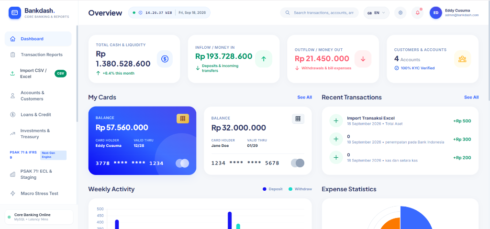
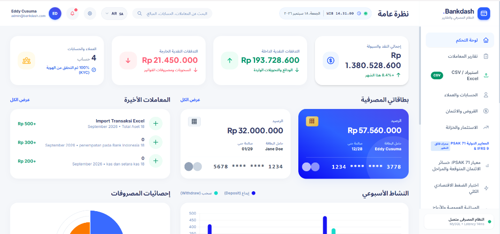
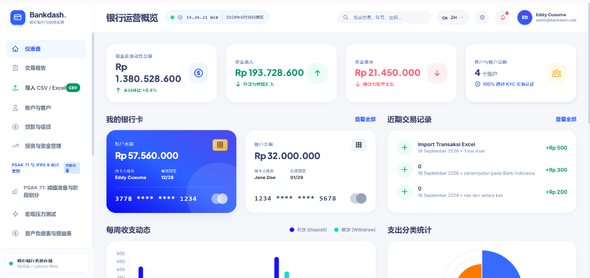

# 🏦 Bankdash — Modern Financial & Core Banking Management Dashboard

Aplikasi web dashboard laporan keuangan dan perbankan modern yang responsif, interaktif, dan terintegrasi untuk manajemen arus kas (*cashflow*), mutasi transaksi, analisa portofolio, dan pelaporan keuangan.

---

## 🛠️ Tech Stack

- **Backend Framework**: [Laravel 11](https://laravel.com/) (PHP 8.2+)
- **Frontend Styling**: [Tailwind CSS](https://tailwindcss.com/)
- **Database**: MySQL / MariaDB
- **Visualisasi Grafik**: [Chart.js](https://www.chartjs.org/)
- **Spreadsheet Engine**: [PhpSpreadsheet](https://phpspreadsheet.readthedocs.io/) (.xlsx & .csv)

---

## 🌐 Fitur Unggulan: Dukungan 4 Bahasa (Multilingual & RTL)

Sistem dilengkapi tombol pengalih bahasa instan dengan dukungan **4 bahasa dunia** dan tata letak otomatis:

1. 🇮🇩 **Bahasa Indonesia (ID)** &mdash; Format finansial Rupiah dan terminologi perbankan nasional.
2. 🇬🇧 **English (EN)** &mdash; Standar terminologi keuangan & *core banking* internasional.
3. 🇸🇦 **العربية (AR)** &mdash; Bahasa Arab lengkap dengan tata letak **RTL (*Right-to-Left*)** otomatis dan font *Noto Sans Arabic*.
4. 🇨🇳 **中文 (ZH)** &mdash; Bahasa Mandarin (*Simplified Chinese*) untuk laporan keuangan.

---

## 📸 Tampilan Antarmuka Multibahasa

### 1. Bahasa Indonesia (ID)


---

### 2. English (EN)


---

### 3. العربية — Arabic with RTL Layout (AR)


---

### 4. 中文 — Simplified Chinese (ZH)


---

## 🚀 Fitur Utama Sistem

- **Executive Financial Dashboard**: Ringkasan total likuiditas kas, *inflow*, *outflow*, kartu debit virtual, serta mutasi terbaru.
- **Visual Analytics & Interactive Charts**: Grafik perbandingan setoran vs penarikan mingguan, persentase kategori pengeluaran, dan tren riwayat saldo tahunan.
- **Batch Import Excel / CSV**: Unggah data transaksi dan portofolio keuangan secara massal dengan pemetaan otomatis.
- **Credit & Risk Portfolio Analysis**: Pemantauan profil risiko kredit debitur, klasifikasi kolektibilitas, dan simulasi stresstest makroekonomi.
- **Cetak Rekening Koran Resmi**: Pembuat rekening koran nasabah (*Bank Statement*) dengan tata letak siap cetak / PDF.
- **Security & Audit Trail Log**: Pencatatan riwayat setiap aktivitas transaksi dan perubahan data pengguna.

---

## 💡 Silakan Gunakan & Kembangkan Sesuai Keinginan Anda!

> Proyek ini dibuat dengan semangat belajar dan berbagi. **Silakan gunakan, modifikasi, dan atur template source code ini sesuka hati Anda** untuk keperluan:
> - Bahan pembelajaran, tugas akhir, skripsi, maupun portofolio
> - Sistem pencatatan keuangan internal UMKM / Koperasi / Usaha
> - Fondasi awal (*starter kit*) aplikasi fintech dan perbankan
> 
> *Catatan & Permohonan Maaf:*  
> Proyek ini dibangun sebagai sarana eksplorasi teknologi. **Mohon maaf yang sebesar-besarnya apabila masih terdapat kekurangan, kekeliruan logika, ataupun ketidaksempurnaan pada kode dan antarmuka web ini.** Segala bentuk kritik, masukan yang membangun, serta saran perbaikan akan selalu diterima dengan tangan terbuka demi pembelajaran yang lebih baik.

---

## 👨‍💻 Pengembang & Kolaborasi

- **Pengembang**: **Bima Junestifa** (Pelajar & Tech Enthusiast)
- **Email Kolaborasi**: [bimajunestifa85@gmail.com](mailto:bimajunestifa85@gmail.com)

Terbuka untuk diskusi, berbagi saran, atau kolaborasi proyek pengembangan web berikutnya.

---

## 🛠️ Panduan Instalasi Singkat

```bash
# 1. Clone repository
git clone https://github.com/username/bankdash-core.git
cd bankdash-core

# 2. Install dependency PHP
composer install

# 3. Salin konfigurasi environment & buat application key
cp .env.example .env
php artisan key:generate

# 4. Konfigurasi database MySQL di file .env, lalu jalankan migrasi
php artisan migrate --seed

# 5. Jalankan web server lokal
php artisan serve
```

Akses di browser: `http://127.0.0.1:8000`.
